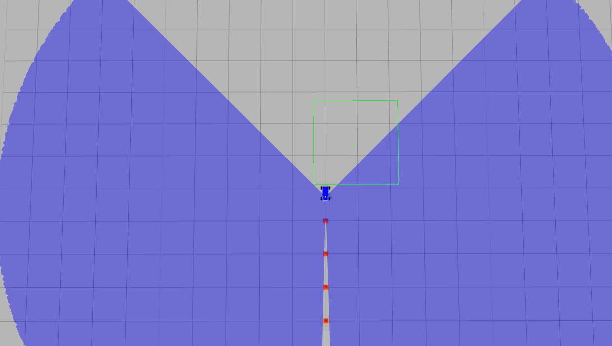
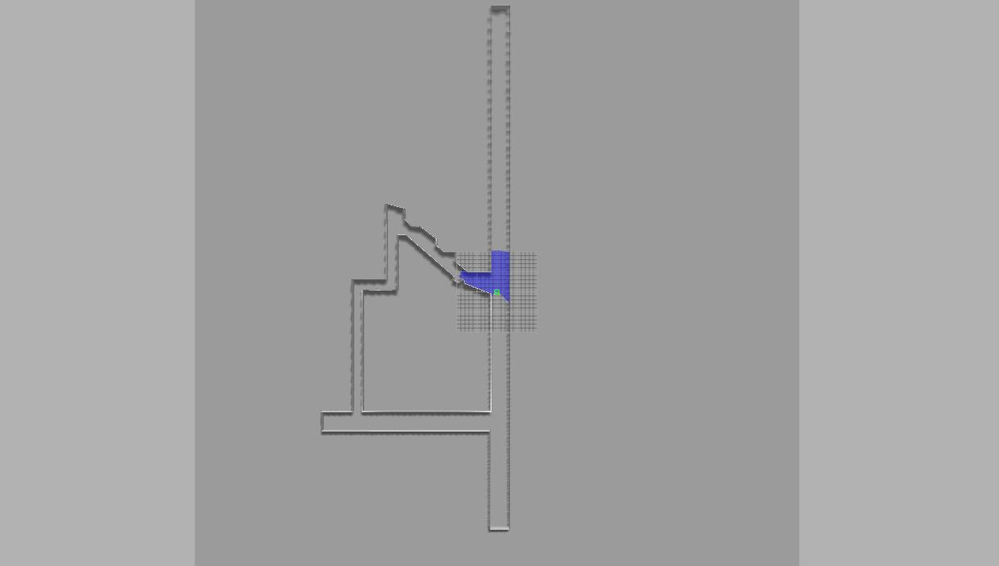
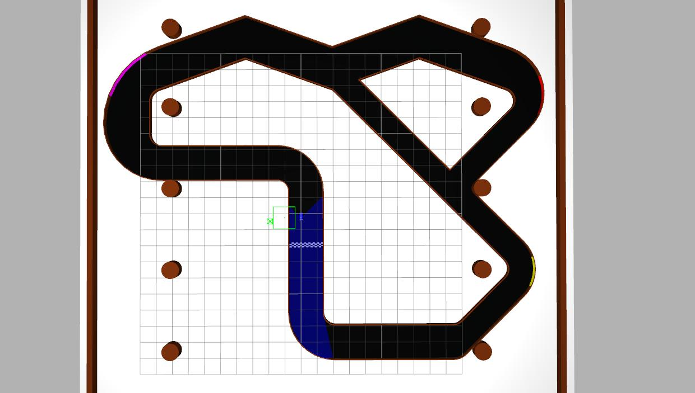

# PC Setup for Gazebo Simulation

# F1tenth - PC Setup for Gazebo Simulation

The F1tenth platform can be simulated using Gazebo. 

## Install Dependencies

* Once all the required installations have been performed, install the following:

serial:

``` 
sudo apt-get install ros-kinetic-serial
```
controller_manager:

``` 
sudo apt-get install ros-kinetic-controller-manager
```
gazebo_ros_control:

``` 
sudo apt-get install ros-kinetic-gazebo-ros-control
```
joint_state_controller:

``` 
sudo apt-get install ros-kinetic-joint-state-controller 
```
effort_controllers

``` 
sudo apt-get install ros-kinetic-effort-controllers
```

## Build simulation packages
    # Copy race folder to the src folder under current workspace
    cp -r ~/F1tenth_BU/race_simulator ~/catkin_ws/src/
    # Build the pacakges
    source /opt/ros/kinetic/setup.bash
    cd ..
    catkin_make
    source devel/setup.bash

### Run the simulated car in Gazebo

Launch the simulation environment by

    source ~/catkin_ws/devel/setup.bash
    # Multiple environments with different suffix
    roslaunch racecar_gazebo racecar_cones.launch
    # or
    roslaunch racecar_gazebo racecar_tunnel.launch
    # or
    roslaunch racecar_gazebo racecar_walker.launch
<p float="left">



<br>
<em>Environment from left to right: cones, tunnel and walker</em>
</p>


    
Keyboard/Path_tracking control node

    <node pkg="racecar_control" type="keyboard_teleop.py" name="keyboard_teleop" output="screen" launch-prefix="xterm -e"/>
    <node pkg="racecar_control" type="path_tracking.py" name="path_tracking" output="screen" launch-prefix="xterm -e"/>

## Mapping and Localization in Gazebo (use google cartographer for SLAM)

### 1) Install google cartographer and ROS integration
follow instruction [here](https://google-cartographer-ros.readthedocs.io/en/latest/) or commandlines below.

    # Install wstool and rosdep. 
    sudo apt-get update 
    sudo apt-get install -y python-wstool python-rosdep ninja-build 
    
    # Create a new workspace in 'slam_ws'. 
    mkdir slam_ws 
    cd slam_ws 
    wstool init src 
    
    # Merge the cartographer_ros.rosinstall file and fetch code for dependencies. 
    wstool merge -t src https://raw.githubusercontent.com/googlecartographer/cartographer_ros/master/cartographer_ros.rosinstall 
    wstool update -t src 
    
    # Install proto3. src/cartographer/scripts/install_proto3.sh 
    # Install deb dependencies.  
    # The command 'sudo rosdep init' will print an error if you have already  
    # executed it since installing ROS. This error can be ignored. 
    sudo rosdep init 
    rosdep update 
    rosdep install --from-paths src --ignore-src --rosdistro=${ROS_DISTRO} -y 
    
    # Build and install. 
    catkin_make_isolated --install --use-ninja 
    source install_isolated/setup.bash

### 2) Build a map and save it for localization later
Substitute with **[mapping_sim.launch](https://github.com/JmfanBU/F1tenth_BU/blob/master/slam/mapping_sim.launch)** and **[demo\_backpack\_2d\_localization.launch](https://github.com/JmfanBU/F1tenth_BU/blob/master/slam/demo_backpack_2d_localization.launch)** in cartographer\_ros launch directory. Add **[mapping.lua](mapping.lua)** to configuration_files directory.

    # Substitute launch files
    cp ~/F1tenth_BU/slam/mapping_sim.launch ~/slam_ws/src/cartographer_ros/cartographer_ros/launch
    cp ~/F1tenth_BU/slam/demo_backpack_2d_localization.launch ~/slam_ws/src/cartographer_ros/cartographer_ros/launch
    
    # Add configuration files
    cp ~/F1tenth_BU/slam/mapping.lua ~/slam_ws/src/cartographer_ros/cartographer_ros/configuration_files
    cp -r ~/F1tenth_BU/slam/racecar_description ~/slam_ws/build_isolated/cartographer_ros/
    
    # Rebuild the package
    catkin_make_isolated --install --use-ninja 
    source install_isolated/setup.bash
    
Start gazebo environment first.
    
    # The lidar is already in the description file and publish range
    # information through topic \scan
    roslaunch racecar_gazebo racecar_*.launch
    
Start ***cartographer\_node*** by following commandline

      # start the mapping node and rviz for visulization
      roslaunch cartographer_ros mapping_sim.launch
   
Use the arrow keys on the keyboard to manually control the car moving around to explore and build a map. The built map will be more precise if the car moves slowly and turns smoothly.

    # start to keyboard control 
    python ~/race/src/keyboard.py
    

After you finish building the map, save the map into a **.pbstram** file for further use. 

      # call the /write_state service to save it
      # use your own map_file_path and map_file_name in the commandline
      rosservice call /write_state ~/map_file_path/map_file_name.bag.pbstream
### 3) Use the saved map for localization
Use the following commandline to localize the car

      # load the map by specifying the load_state_filename 
      roslaunch cartographer_ros demo_backpack_2d_localization.launch    load_state_filename:=${HOME}/map_file_name.bag.pbstream
      # start rviz for visualization
      rosrun rviz rviz -d `rospack find cartographer_ros`/configuration_files/demo_2d.rviz
 A **/tf** from *map\_frame* (typically map) to *published\_frame*(typically base_link) is broadcasted and you can listen to the transformation to get the car's location in *map\_frame*.
 
 ### 4) Path tracking in racecar_wg environment
    # start gazebo simulation
    roslaunch racecar_gazebo racecar_wg.launch
    # pid control with localization directly from simulator
    roslaunch racecar_control racecar_control_ideal_pid.launch
    # lqr steer controller on straight line with lidar localization
    roslaunch racecar_control racecar_control_lqr_line.launch
    # lqr steer controller on cubic path with lidar localization
    roslaunch racecar_control racecar_control_lqr_cubic.launch
